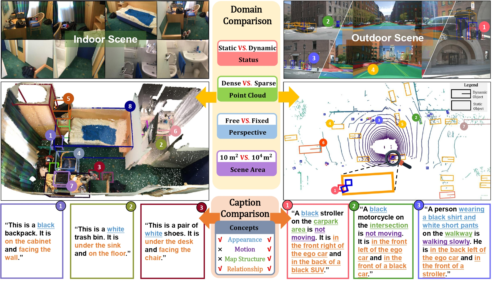
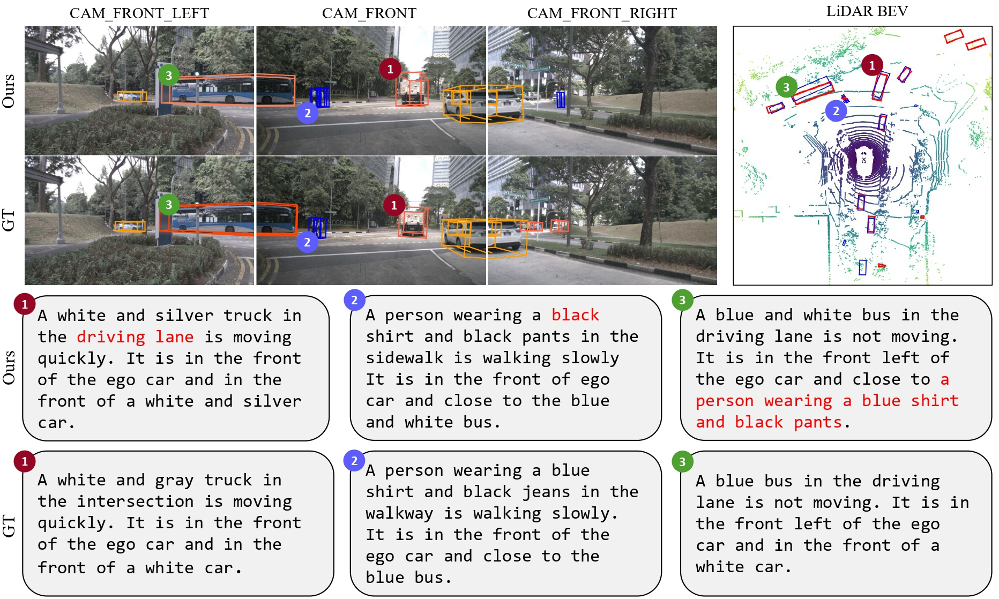

# TOD3Cap: Towards 3D Dense Captioning in Outdoor Scenes
<div align=center>  </div>

This repository is an official implementation of [TOD3Cap: Towards 3D Dense Captioning in Outdoor Scenes](https://arxiv.org/abs/xxxx.xxxxx).

## Introduction

We introduce the new task of outdoor 3D dense captioning. As input, we assume a LiDAR point cloud and a set of RGB images captured by the panoramic camera rig. The expected output is a set of object boxes with captions. To tackle this task, we propose the TOD^3^Cap network, which leverages the BEV representation to generate object box proposals and integrates Relation Q-Former with LLaMA-Adapter to generate rich captions for these objects. We also introduce the TOD^3Cap dataset, the largest one to our knowledge for 3D dense captioning in outdoor scenes, which contains 2.3M descriptions of 64.3K outdoor objects from 850 scenes in [nuScenes](https://www.nuscenes.org/).

## Note
This reposity will be updated soon, including:
- [x] **Initialization**.
- [ ] Uploading the **TOD^3^Cap Dataset**.
- [ ] Uploading the **Annotation Tools**.
- [ ] Uploading the codes of **TOD^3^Cap Network**.
- [ ] Uploading the **Installation** guidelines.
- [ ] Uploading the **Training** and **Evaluation** scripts.
- [ ] Uploading the **Visualization** scripts of gt data and predicted results.
- [ ] Uploading the **Baselines** implementation.


## Table of contents
- [TOD3Cap: Towards 3D Dense Captioning in Outdoor Scenes](#tod3cap-towards-3d-dense-captioning-in-outdoor-scenes)
  - [Introduction](#introduction)
  - [Note](#note)
  - [Table of contents](#table-of-contents)
  - [Getting Started](#getting-started)
  - [Models](#models)
  - [Training](#training)
  - [Qualititive results](#qualititive-results)
  - [Citation](#citation)
  - [Acknowledgments](#acknowledgments)


## Getting Started
Following https://mmdetection3d.readthedocs.io/en/latest/getting_started.html#installation
a. Create a conda virtual environment and activate it.
```bash
conda create -n tod3cap python=3.8 -y 
conda activate tod3cap
```
b. Install PyTorch and torchvision following the official instructions.
```bash
pip install torch==1.9.1+cu111 torchvision==0.10.1+cu111 torchaudio==0.9.1 -f https://download.pytorch.org/whl/torch_stable.html
# Recommended torch>=1.9
```

c. Install gcc>=5 in conda env (optional).
```bash
conda install -c omgarcia gcc-6 # gcc-6.2
```

d. Install mmcv-full.
```bash
pip install mmcv-full==1.4.0
#  pip install mmcv-full==1.4.0 -f https://download.openmmlab.com/mmcv/dist/cu111/torch1.9.0/index.html
```

e. Install mmdet and mmseg.
```bash
pip install mmdet==2.14.0
pip install mmsegmentation==0.14.1
```

f. Install mmdet3d from source code.
```bash
git clone https://github.com/open-mmlab/mmdetection3d.git
cd mmdetection3d
git checkout v0.17.1 # Other versions may not be compatible.
python setup.py install
```

g. Install Detectron2 and Timm.
```bash
pip install einops fvcore seaborn iopath==0.1.9 timm==0.6.13  typing-extensions==4.5.0 pylint ipython==8.12  numpy==1.19.5 matplotlib==3.5.2 numba==0.48.0 pandas==1.4.4 scikit-image==0.19.3 setuptools==59.5.0
python -m pip install 'git+https://github.com/facebookresearch/detectron2.git'
```

h. Install other dependencies.
```bash
pip install -r requirements.txt
```

## Models

* We release our best-performing checkpoints. You can download these models at [Google Drive] and place them under `checkpoints` directory. If the directory does not exist, you can create one.

* We release the pretrained detector models we used during training in [Google Drive]. If you want to use other pretrained video-swin models, you can refer to [BEVFormer](https://github.com/fundamentalvision/BEVFormer.git) and [BEVFusion](https://github.com/mit-han-lab/bevfusion.git).


## Dataset Preparation

You can ether download the preprocessed data in [this site](), or just download and preprocess the raw files following [this site](https://github.com/open-mmlab/mmdetection3d/blob/1.0/docs/en/datasets/nuscenes_det.md) by yourself.

## Train

We provide example scripts to train our model.
```bash
. tools/dist_train.sh
```

## Evaluate

We provide example scripts to evaluate pre-trained checkpoints.

```bash
. tools/dist_evaluate.sh
```


## Qualititive results
 <div align=center>  </div>

## Citation

If you find our work useful in your research, please consider citing:

```bibtex
@article{jin2024TOD3Cap,
  title={TOD3Cap: Towards 3D Dense Captioning in Outdoor Scenes},
  year={2023}
}
```


## Acknowledgments

Our code is built on top of open-source GitHub repositories.  We thank all the authors who made their code public, which tremendously accelerates our project progress. If you find these works helpful, please consider citing them as well.

[open-mmlab/mmdetection3d](https://github.com/open-mmlab/mmdetection3d)

[fundamentalvision/BEVFormer](https://github.com/fundamentalvision/BEVFormer.git)

[mit-han-lab/bevfusion](https://github.com/mit-han-lab/bevfusion.git)

[OpenGVLab/LLaMA-Adapter](https://github.com/OpenGVLab/LLaMA-Adapter)